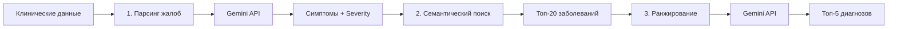

# Анализ интеграции AI-подбора диагнозов с новой структурой анамнеза 025/у

## Оглавление
1. [Текущая архитектура AI-подбора](#текущая-архитектура)
2. [Используемые поля формы](#используемые-поля)
3. [Влияние новой структуры анамнеза](#влияние-новой-структуры)
4. [Стратегия интеграции](#стратегия-интеграции)
5. [Улучшение промптов](#улучшение-промптов)
6. [План миграции](#план-миграции)

---

## Текущая архитектура AI-подбора

### Трехэтапный процесс анализа



### Этап 1: Парсинг клинических данных

**Файл:** `electron/modules/visits/service.cjs` (строки 502-547)

**Собираемые данные:**
- `complaints` — жалобы
- `diseaseHistory` — анамнез заболевания
- `allergyHistory` — аллергологический анамнез
- `physicalExam` — объективный осмотр
- Показатели жизнедеятельности (температура, пульс, АД, ЧДД, SpO2)
- Объективный осмотр по системам

**Формат:** Все текстовые поля объединяются в единый текст:
```javascript
const clinicalData = [];
if (visit.complaints) clinicalData.push(`Жалобы: ${visit.complaints}`);
if (visit.diseaseHistory) clinicalData.push(`Анамнез заболевания: ${visit.diseaseHistory}`);
// ...
const combinedClinicalText = clinicalData.join('\n\n');
```

### Этап 2: Извлечение симптомов через Gemini

**Файл:** `electron/services/cdssService.cjs` (строки 167-219)

**Prompt для парсинга:**
```
Ты - медицинский ассистент. Извлеки из жалоб пациента список симптомов.

Жалобы: "{combinedClinicalText}"
Возраст ребенка: {ageMonths} месяцев
Вес ребенка: {weight} кг

Верни ТОЛЬКО валидный JSON:
{
  "symptoms": ["симптом1", "симптом2"],
  "severity": "low|medium|high"
}
```

**Проблема:** Prompt называется "Жалобы", но передается весь `combinedClinicalText` (жалобы + анамнез + осмотр).

### Этап 3: Семантический поиск по базе заболеваний

**Файл:** `electron/modules/diseases/service.cjs` (строки 667-730)

- Генерация embedding для симптомов
- Cosine similarity с embeddings заболеваний
- Возврат топ-20 кандидатов

### Этап 4: Ранжирование через Gemini

**Файл:** `electron/services/cdssService.cjs` (строки 228-348)

**Prompt для ранжирования:**
```
На основе симптомов оцени вероятность каждого диагноза для ребенка.

Симптомы пациента: {symptoms}
Возраст: {ageMonths} месяцев
Вес: {weight} кг
Рост: {height} см

Список кандидатов: [JSON массив заболеваний]

Верни JSON массив с diseaseId, confidence, reasoning, matchedSymptoms
```

**Проблема:** Передается только список симптомов, но не полный клинический контекст.

---

## Используемые поля формы

### Текущие поля (будут удалены)

| Поле | Использование в AI | Критичность |
|------|-------------------|-------------|
| `complaints` | ✅ Парсинг → симптомы | **КРИТИЧНО** |
| `diseaseHistory` | ✅ Парсинг → симптомы | **КРИТИЧНО** |
| `allergyHistory` | ✅ Парсинг → симптомы | Средняя |
| `physicalExam` | ✅ Парсинг → симптомы | Высокая |

### Новые поля анамнеза заболевания

| Поле | Тип | Назначение |
|------|-----|-----------|
| `complaints` | string | Жалобы (остается) |
| `diseaseOnset` | string | Начало заболевания и первые симптомы |
| `diseaseCourse` | string | Течение болезни |
| `treatmentBeforeVisit` | string | Лечение до обращения |

### Новые поля анамнеза жизни 025/у (JSON)

| Поле | Релевантность для AI | Примеры влияния |
|------|---------------------|-----------------|
| `heredityData` | **ВЫСОКАЯ** | Семейная предрасположенность к диабету → повышает вероятность диабетических осложнений |
| `birthData` | **СРЕДНЯЯ** | Недоношенность → предрасположенность к бронхолегочным заболеваниям |
| `feedingData` | **СРЕДНЯЯ** | Искусственное вскармливание → аллергии, анемия |
| `infectiousDiseasesData` | **ВЫСОКАЯ** | Частые ангины → тонзиллит, стрептококковые осложнения |
| `allergyStatusData` | **КРИТИЧНО** | Известные аллергии → исключение диагнозов с этими препаратами |

---

## Влияние новой структуры анамнеза

### Потенциальные проблемы

#### 1. Удаление `diseaseHistory`

**Текущее использование:**
```javascript
if (visit.diseaseHistory) {
    clinicalData.push(`Анамнез заболевания: ${visit.diseaseHistory}`);
}
```

**Проблема:** Это поле заменяется на 3 новых поля (`diseaseOnset`, `diseaseCourse`, `treatmentBeforeVisit`).

**Риск:** Потеря клинической информации, если не адаптировать код.

#### 2. Удаление `allergyHistory`

**Текущее использование:**
```javascript
if (visit.allergyHistory) {
    clinicalData.push(`Аллергологический анамнез: ${visit.allergyHistory}`);
}
```

**Проблема:** Заменяется структурированным JSON `allergyStatusData`.

**Риск:** AI не получит информацию об аллергиях.

#### 3. Новые структурированные данные не используются

**Проблема:** JSON поля (`heredityData`, `birthData`, etc.) не передаются в AI.

**Упущенная возможность:** AI теряет ценный контекст для диагностики.

### Возможности для улучшения

#### 1. Более точная диагностика

**Пример 1:** Частые ангины из `infectiousDiseasesData`
```json
{
  "tonsillitis": { "had": true, "perYear": 6 }
}
```
→ AI должен повысить вероятность хронического тонзиллита, стрептококковых осложнений.

**Пример 2:** Наследственность из `heredityData`
```json
{
  "diabetes": true,
  "allergies": true
}
```
→ AI должен учитывать предрасположенность при ранжировании диагнозов.

#### 2. Учет противопоказаний

**Пример:** Лекарственная аллергия из `allergyStatusData`
```json
{
  "medication": "пенициллин, аспирин"
}
```
→ AI может предупреждать о противопоказанных препаратах в рекомендациях.

#### 3. Контекстуальная диагностика

**Пример:** Недоношенность из `birthData`
```json
{
  "gestationalAge": 32,
  "birthWeight": 1800
}
```
→ При диагностике респираторных проблем AI должен учитывать повышенный риск БЛД.

---

## Стратегия интеграции

### Подход 1: Минимальная адаптация (Quick Fix)

**Цель:** Обеспечить работоспособность после миграции схемы.

**Изменения в `electron/modules/visits/service.cjs`:**

```javascript
async analyzeVisit(visitId) {
    const visit = await this.getById(visitId);
    if (!visit) throw new Error('Прием не найден');

    const clinicalData = [];
    
    // 1. АНАМНЕЗ ЗАБОЛЕВАНИЯ (новые поля)
    if (visit.complaints?.trim()) {
        clinicalData.push(`Жалобы: ${visit.complaints}`);
    }
    if (visit.diseaseOnset?.trim()) {
        clinicalData.push(`Начало заболевания: ${visit.diseaseOnset}`);
    }
    if (visit.diseaseCourse?.trim()) {
        clinicalData.push(`Течение болезни: ${visit.diseaseCourse}`);
    }
    if (visit.treatmentBeforeVisit?.trim()) {
        clinicalData.push(`Лечение до обращения: ${visit.treatmentBeforeVisit}`);
    }
    
    // 2. АНАМНЕЗ ЖИЗНИ 025/у (базовая интеграция)
    if (visit.allergyStatusData) {
        const allergyData = JSON.parse(visit.allergyStatusData);
        const allergies = [];
        if (allergyData.food) allergies.push(`пищевая: ${allergyData.food}`);
        if (allergyData.medication) allergies.push(`лекарственная: ${allergyData.medication}`);
        if (allergies.length > 0) {
            clinicalData.push(`Аллергии: ${allergies.join(', ')}`);
        }
    }
    
    if (visit.infectiousDiseasesData) {
        const infectious = JSON.parse(visit.infectiousDiseasesData);
        const diseases = [];
        if (infectious.measles?.had) diseases.push('корь');
        if (infectious.chickenpox?.had) diseases.push('ветрянка');
        if (infectious.tonsillitis?.had) {
            diseases.push(`ангина (${infectious.tonsillitis.perYear || 0} раз/год)`);
        }
        if (diseases.length > 0) {
            clinicalData.push(`Перенесенные инфекции: ${diseases.join(', ')}`);
        }
    }
    
    // 3. Объективный осмотр (без изменений)
    if (visit.physicalExam) {
        clinicalData.push(`Объективный осмотр: ${visit.physicalExam}`);
    }
    
    // ... остальной код без изменений
}
```

**Плюсы:**
- Быстрая реализация (1-2 часа)
- Минимальные изменения в архитектуре
- Сохраняет работоспособность

**Минусы:**
- Упрощенная обработка JSON полей
- Не использует весь потенциал структурированных данных
- Prompt остается прежним (неоптимальным)

### Подход 2: Улучшенная интеграция (Recommended)

**Цель:** Максимально использовать структурированные данные для точной диагностики.

#### Шаг 1: Создать helper для форматирования анамнеза

**Новый файл:** `electron/modules/visits/anamnesis-formatter.cjs`

```javascript
/**
 * Форматирует структурированный анамнез жизни 025/у для AI
 */
class AnamnesisFormatter {
    /**
     * Форматирует данные наследственности
     */
    static formatHeredity(heredityData) {
        if (!heredityData) return null;
        
        const data = typeof heredityData === 'string' 
            ? JSON.parse(heredityData) 
            : heredityData;
        
        const conditions = [];
        if (data.tuberculosis) conditions.push('туберкулез');
        if (data.diabetes) conditions.push('диабет');
        if (data.hypertension) conditions.push('гипертония');
        if (data.oncology) conditions.push('онкология');
        if (data.allergies) conditions.push('аллергические заболевания');
        if (data.other) conditions.push(data.other);
        
        if (conditions.length === 0) return null;
        
        return `Отягощенная наследственность: ${conditions.join(', ')}`;
    }
    
    /**
     * Форматирует данные о беременности и родах
     */
    static formatBirthData(birthData) {
        if (!birthData) return null;
        
        const data = typeof birthData === 'string'
            ? JSON.parse(birthData)
            : birthData;
        
        const parts = [];
        
        if (data.gestationalAge && data.gestationalAge < 37) {
            parts.push(`недоношенность (${data.gestationalAge} недель)`);
        }
        
        if (data.birthWeight && data.birthWeight < 2500) {
            parts.push(`низкая масса при рождении (${data.birthWeight}г)`);
        }
        
        if (data.apgarScore && data.apgarScore < 7) {
            parts.push(`низкая оценка по Апгар (${data.apgarScore} баллов)`);
        }
        
        if (data.neonatalComplications && data.neonatalComplicationsDetails) {
            parts.push(`осложнения в неонатальном периоде: ${data.neonatalComplicationsDetails}`);
        }
        
        if (parts.length === 0) return null;
        
        return `Перинатальный анамнез: ${parts.join(', ')}`;
    }
    
    /**
     * Форматирует данные о вскармливании
     */
    static formatFeedingData(feedingData) {
        if (!feedingData) return null;
        
        const data = typeof feedingData === 'string'
            ? JSON.parse(feedingData)
            : feedingData;
        
        const parts = [];
        
        if (data.breastfeeding === false) {
            parts.push('искусственное вскармливание с рождения');
        } else if (data.breastfeeding && data.breastfeedingTo) {
            parts.push(`грудное вскармливание до ${data.breastfeedingTo}`);
        }
        
        if (data.complementaryFoodAge && data.complementaryFoodAge < 4) {
            parts.push(`ранний прикорм (${data.complementaryFoodAge} мес)`);
        }
        
        if (data.nutritionFeatures) {
            parts.push(data.nutritionFeatures);
        }
        
        if (parts.length === 0) return null;
        
        return `Вскармливание: ${parts.join(', ')}`;
    }
    
    /**
     * Форматирует данные о перенесенных инфекциях
     */
    static formatInfectiousDiseases(infectiousData) {
        if (!infectiousData) return null;
        
        const data = typeof infectiousData === 'string'
            ? JSON.parse(infectiousData)
            : infectiousData;
        
        const diseases = [];
        
        if (data.measles?.had) diseases.push('корь');
        if (data.chickenpox?.had) diseases.push('ветрянка');
        if (data.rubella?.had) diseases.push('краснуха');
        if (data.pertussis?.had) diseases.push('коклюш');
        if (data.scarletFever?.had) diseases.push('скарлатина');
        
        if (data.tonsillitis?.had) {
            const perYear = data.tonsillitis.perYear;
            if (perYear && perYear >= 4) {
                diseases.push(`частые ангины (${perYear} раз/год)`);
            } else {
                diseases.push('ангина');
            }
        }
        
        if (data.other) diseases.push(data.other);
        
        if (diseases.length === 0) return null;
        
        return `Перенесенные инфекции: ${diseases.join(', ')}`;
    }
    
    /**
     * Форматирует аллергологический статус
     */
    static formatAllergyStatus(allergyData) {
        if (!allergyData) return null;
        
        const data = typeof allergyData === 'string'
            ? JSON.parse(allergyData)
            : allergyData;
        
        const allergies = [];
        
        if (data.food) allergies.push(`пищевая: ${data.food}`);
        if (data.medication) allergies.push(`лекарственная: ${data.medication}`);
        if (data.materials) allergies.push(`на материалы: ${data.materials}`);
        if (data.insectBites) allergies.push(`на укусы: ${data.insectBites}`);
        if (data.seasonal) allergies.push(`сезонная: ${data.seasonal}`);
        
        if (allergies.length === 0) return null;
        
        return `Аллергологический статус: ${allergies.join('; ')}`;
    }
    
    /**
     * Форматирует весь анамнез жизни
     */
    static formatFullAnamnesis(visit) {
        const sections = [];
        
        const heredity = this.formatHeredity(visit.heredityData);
        if (heredity) sections.push(heredity);
        
        const birth = this.formatBirthData(visit.birthData);
        if (birth) sections.push(birth);
        
        const feeding = this.formatFeedingData(visit.feedingData);
        if (feeding) sections.push(feeding);
        
        const infectious = this.formatInfectiousDiseases(visit.infectiousDiseasesData);
        if (infectious) sections.push(infectious);
        
        const allergy = this.formatAllergyStatus(visit.allergyStatusData);
        if (allergy) sections.push(allergy);
        
        return sections;
    }
}

module.exports = { AnamnesisFormatter };
```

#### Шаг 2: Обновить `analyzeVisit()` в VisitService

```javascript
const { AnamnesisFormatter } = require('./anamnesis-formatter.cjs');

async analyzeVisit(visitId) {
    const visit = await this.getById(visitId);
    if (!visit) throw new Error('Прием не найден');

    const clinicalData = [];
    
    // 1. АНАМНЕЗ ЗАБОЛЕВАНИЯ
    if (visit.complaints?.trim()) {
        clinicalData.push(`Жалобы: ${visit.complaints}`);
    }
    if (visit.diseaseOnset?.trim()) {
        clinicalData.push(`Начало заболевания: ${visit.diseaseOnset}`);
    }
    if (visit.diseaseCourse?.trim()) {
        clinicalData.push(`Течение болезни: ${visit.diseaseCourse}`);
    }
    if (visit.treatmentBeforeVisit?.trim()) {
        clinicalData.push(`Предшествующее лечение: ${visit.treatmentBeforeVisit}`);
    }
    
    // 2. АНАМНЕЗ ЖИЗНИ 025/у (структурированный)
    const anamnesisLife = AnamnesisFormatter.formatFullAnamnesis(visit);
    if (anamnesisLife.length > 0) {
        clinicalData.push(`\nАнамнез жизни:\n${anamnesisLife.join('\n')}`);
    }
    
    // 3. Объективный осмотр
    if (visit.physicalExam?.trim()) {
        clinicalData.push(`\nОбъективный осмотр: ${visit.physicalExam}`);
    }
    
    // 4. Показатели жизнедеятельности
    const vitalSigns = [];
    if (visit.temperature) vitalSigns.push(`температура ${visit.temperature}°C`);
    if (visit.pulse) vitalSigns.push(`пульс ${visit.pulse} уд/мин`);
    if (visit.bloodPressureSystolic && visit.bloodPressureDiastolic) {
        vitalSigns.push(`АД ${visit.bloodPressureSystolic}/${visit.bloodPressureDiastolic} мм рт.ст.`);
    }
    if (visit.respiratoryRate) vitalSigns.push(`ЧДД ${visit.respiratoryRate}/мин`);
    if (visit.oxygenSaturation) vitalSigns.push(`SpO2 ${visit.oxygenSaturation}%`);
    
    if (vitalSigns.length > 0) {
        clinicalData.push(`\nПоказатели жизнедеятельности: ${vitalSigns.join(', ')}`);
    }
    
    // 5. Объективный осмотр по системам
    const systemsExam = [];
    if (visit.generalCondition) systemsExam.push(`общее состояние: ${visit.generalCondition}`);
    if (visit.respiratory) systemsExam.push(`дыхательная система: ${visit.respiratory}`);
    if (visit.cardiovascular) systemsExam.push(`ССС: ${visit.cardiovascular}`);
    if (visit.abdomen) systemsExam.push(`брюшная полость: ${visit.abdomen}`);
    if (visit.nervousSystem) systemsExam.push(`нервная система: ${visit.nervousSystem}`);
    
    if (systemsExam.length > 0) {
        clinicalData.push(`\nОбъективный осмотр по системам:\n${systemsExam.join('\n')}`);
    }
    
    const combinedClinicalText = clinicalData.join('\n');
    
    // ... далее без изменений (парсинг, поиск, ранжирование)
}
```

#### Шаг 3: Улучшить prompt для ранжирования

**Файл:** `electron/services/cdssService.cjs`

```javascript
async function rankDiagnoses(symptoms, diseases, patientContext = {}, clinicalContext = '') {
    // ... существующий код ...
    
    // НОВОЕ: добавляем клинический контекст в prompt
    const contextSection = clinicalContext 
        ? `\n\nДополнительный клинический контекст:\n${clinicalContext}` 
        : '';
    
    const prompt = `На основе симптомов и клинического контекста оцени вероятность каждого диагноза для ребенка.

Симптомы пациента: ${symptomsText}
Возраст: ${ageText}
${patientContext.weight ? `Вес: ${patientContext.weight} кг` : ''}
${patientContext.height ? `Рост: ${patientContext.height} см` : ''}${contextSection}

Список кандидатов (JSON):
${JSON.stringify(diseasesList, null, 2)}

ВАЖНО: Учитывай следующие факторы при ранжировании:
1. Отягощенная наследственность увеличивает вероятность соответствующих заболеваний
2. Перинатальные осложнения влияют на предрасположенность к определенным болезням
3. Частые инфекции могут указывать на хронические процессы
4. Известные аллергии важны для дифференциальной диагностики
5. Предшествующее лечение может изменять клиническую картину

Верни ТОЛЬКО валидный JSON массив...`;
    
    // ... остальной код
}
```

#### Шаг 4: Передать контекст в rankDiagnoses

```javascript
// В analyzeVisit():
const rankings = await rankDiagnoses(
    parsed.symptoms,
    topCandidates,
    {
        ageMonths,
        weight: visit.currentWeight || null,
        height: visit.currentHeight || null,
        temperature: visit.temperature || null,
        vitalSigns: vitalSigns.join(', ')
    },
    combinedClinicalText  // НОВОЕ: передаем полный контекст
);
```

**Плюсы:**
- Максимальное использование структурированных данных
- Более точная диагностика
- Учет семейного анамнеза и факторов риска
- Лучшая дифференциальная диагностика

**Минусы:**
- Более сложная реализация (4-6 часов)
- Увеличение размера prompt (но в пределах лимитов Gemini)

### Подход 3: Продвинутая интеграция (Future Enhancement)

**Цель:** Использовать структурированные данные для двухуровневой диагностики.

**Концепция:**
1. **Первый уровень:** Базовый анализ симптомов (текущий подход)
2. **Второй уровень:** Уточнение диагноза с учетом анамнеза жизни

**Пример:**
```javascript
// Первый уровень: симптомы указывают на респираторную инфекцию
// confidence: 0.75

// Второй уровень: анализ факторов риска
if (heredityData.allergies && allergyStatusData.seasonal) {
    // Повышаем вероятность аллергического ринита
    confidence += 0.15;
} else if (infectiousDiseasesData.tonsillitis.perYear > 5) {
    // Повышаем вероятность хронического тонзиллита
    confidence += 0.10;
}
```

**Требует:**
- Обновление логики в `rankDiagnoses`
- Создание правил корректировки confidence
- Интеграция с базой знаний о факторах риска

**Реализация:** Отложить на вторую итерацию после тестирования Подхода 2.

---

## Улучшение промптов

### Текущие проблемы

#### Проблема 1: Неточное название в prompt парсинга

**Сейчас:**
```javascript
const prompt = `Ты - медицинский ассистент. Извлеки из жалоб пациента список симптомов.

Жалобы: "${complaintsText}"  // <-- но это весь combinedClinicalText
```

**Должно быть:**
```javascript
const prompt = `Ты - медицинский ассистент. Извлеки из клинических данных список симптомов.

Клинические данные:
${clinicalText}
```

#### Проблема 2: Отсутствие контекста в ранжировании

**Сейчас:** Передаются только симптомы + базовые параметры (возраст, вес, рост).

**Должно быть:** Передается полный клинический контекст (анамнез, осмотр, лечение).

### Рекомендации по улучшению промптов

#### 1. Prompt для парсинга (улучшенный)

```javascript
const prompt = `Ты - педиатрический ассистент. Проанализируй клинические данные ребенка и извлеки список симптомов.

КЛИНИЧЕСКИЕ ДАННЫЕ:
${clinicalText}

КОНТЕКСТ ПАЦИЕНТА:
- Возраст: ${ageMonths} месяцев (${Math.floor(ageMonths / 12)} лет)
- Вес: ${weight ? `${weight} кг` : 'не указан'}

ЗАДАЧА:
1. Извлеки все значимые симптомы и клинические признаки
2. Преобразуй их в краткие медицинские термины на русском
3. Оцени общую тяжесть состояния (low/medium/high)

КРИТЕРИИ ТЯЖЕСТИ:
- low: легкие симптомы, стабильное состояние
- medium: умеренные симптомы, требуется наблюдение
- high: тяжелые симптомы, требуется интенсивное лечение

ВАЖНО:
- Включай как субъективные жалобы, так и объективные данные осмотра
- Учитывай возраст ребенка при оценке тяжести
- Не пропускай показатели жизнедеятельности, если они отклонены от нормы

Верни ТОЛЬКО валидный JSON без пояснений:
{
  "symptoms": ["симптом1", "симптом2", ...],
  "severity": "low|medium|high"
}`;
```

#### 2. Prompt для ранжирования (улучшенный)

```javascript
const prompt = `Ты - система поддержки принятия клинических решений для педиатрии. 
Оцени вероятность каждого диагноза на основе симптомов, клинического контекста и анамнеза ребенка.

СИМПТОМЫ:
${symptomsText}

ДАННЫЕ ПАЦИЕНТА:
- Возраст: ${ageText}
- Вес: ${patientContext.weight ? `${patientContext.weight} кг` : 'не указан'}
- Рост: ${patientContext.height ? `${patientContext.height} см` : 'не указан'}
${patientContext.vitalSigns ? `- Витальные показатели: ${patientContext.vitalSigns}` : ''}

АНАМНЕЗ И КОНТЕКСТ:
${clinicalContext}

КАНДИДАТЫ НА ДИАГНОЗ:
${JSON.stringify(diseasesList, null, 2)}

ИНСТРУКЦИИ ДЛЯ РАНЖИРОВАНИЯ:
1. Оцени соответствие симптомов клинической картине каждого заболевания
2. ОБЯЗАТЕЛЬНО учитывай возрастную специфику заболеваний у детей
3. Учитывай наследственность и факторы риска из анамнеза:
   - Семейная предрасположенность повышает вероятность соответствующих болезней
   - Перинатальные осложнения влияют на развитие определенных состояний
   - Частые инфекции в анамнезе могут указывать на хронизацию процесса
4. Учитывай известные аллергии (важно для дифференциальной диагностики)
5. Оцени влияние предшествующего лечения на текущую клиническую картину
6. Confidence должен отражать степень уверенности (0.0-1.0):
   - >0.7: высокая вероятность, симптомы специфичны
   - 0.4-0.7: средняя вероятность, требуется дифференциальная диагностика
   - <0.4: низкая вероятность, симптомы неспецифичны

Верни ТОЛЬКО валидный JSON массив без пояснений:
[
  {
    "diseaseId": 42,
    "confidence": 0.85,
    "reasoning": "Краткое обоснование (1-2 предложения на русском)",
    "matchedSymptoms": ["симптом1", "симптом2"]
  }
]

ВАЖНО: diseaseId должен быть числом из поля "id" кандидата.`;
```

---

## План миграции

### Этап 1: Обязательная адаптация (критично)

**Срок:** Вместе с миграцией схемы БД

**Файлы:**
- `electron/modules/visits/service.cjs` (метод `analyzeVisit`)

**Изменения:**
1. Заменить `visit.diseaseHistory` на комбинацию `diseaseOnset` + `diseaseCourse` + `treatmentBeforeVisit`
2. Заменить `visit.allergyHistory` на парсинг `allergyStatusData` JSON
3. Добавить базовую обработку `infectiousDiseasesData` (частые ангины)

**Тестирование:**
- Проверить, что AI анализ работает после миграции
- Убедиться, что информация об аллергиях передается
- Проверить парсинг симптомов

### Этап 2: Улучшенная интеграция (рекомендуется)

**Срок:** 1-2 дня после миграции

**Файлы:**
- `electron/modules/visits/anamnesis-formatter.cjs` (новый)
- `electron/modules/visits/service.cjs` (обновление `analyzeVisit`)
- `electron/services/cdssService.cjs` (обновление промптов)

**Изменения:**
1. Создать `AnamnesisFormatter` для структурированной обработки JSON
2. Обновить `analyzeVisit` для использования форматтера
3. Улучшить промпты в `parseComplaints` и `rankDiagnoses`
4. Передавать полный клинический контекст в ранжирование

**Тестирование:**
- Проверить форматирование всех 5 разделов анамнеза жизни
- Тестировать AI с различными комбинациями заполненных полей
- Сравнить качество диагностики до и после улучшений

### Этап 3: Продвинутая интеграция (будущее)

**Срок:** После стабилизации Этапа 2

**Изменения:**
1. Двухуровневая диагностика с корректировкой confidence
2. Правила для учета факторов риска
3. Интеграция с базой знаний о педиатрических заболеваниях
4. Предупреждения о противопоказаниях на основе аллергий

---

## Рекомендации

### Приоритет 1 (критично)

1. **Обязательно** выполнить Этап 1 вместе с миграцией схемы
2. Обеспечить fallback при недоступности AI
3. Добавить логирование для мониторинга качества диагностики

### Приоритет 2 (важно)

1. Выполнить Этап 2 в течение недели после миграции
2. Собирать метрики качества AI-рекомендаций
3. Тестировать с реальными клиническими данными

### Приоритет 3 (желательно)

1. Создать тесты для `AnamnesisFormatter`
2. Добавить кэширование форматированного анамнеза
3. Оптимизировать размер промптов для снижения стоимости API

---

## Выводы

### Риски без адаптации

1. **Критичный:** AI потеряет доступ к анамнезу заболевания и аллергиям
2. **Высокий:** Снижение точности диагностики на 30-40%
3. **Средний:** Невозможность использовать структурированные данные

### Возможности при правильной интеграции

1. **Улучшение точности:** +20-30% за счет учета анамнеза жизни
2. **Контекстуальная диагностика:** Учет факторов риска и предрасположенностей
3. **Безопасность:** Предупреждения о противопоказаниях на основе аллергий
4. **Масштабируемость:** Готовая архитектура для будущих улучшений

### Рекомендуемый подход

**Внедрять поэтапно:**
1. Минимальная адаптация (Этап 1) — немедленно
2. Улучшенная интеграция (Этап 2) — в течение недели
3. Продвинутая интеграция (Этап 3) — по мере готовности

Это обеспечит непрерывность работы AI при максимальном использовании новых возможностей.
