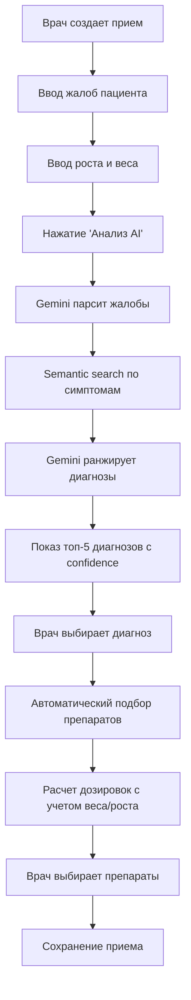

# Руководство по системе CDSS (Clinical Decision Support System)

## Обзор

Система CDSS (Clinical Decision Support System) - это интеллектуальная система поддержки принятия клинических решений, которая помогает врачу в реальном времени при постановке диагноза и назначении лечения.

## Архитектура

Система состоит из трех основных модулей:

1. **База знаний (Diseases)** - хранение заболеваний с симптомами, ICD-10 кодами и клиническими рекомендациями
2. **Препараты (Medications)** - справочник препаратов с точными правилами дозирования
3. **Приемы (Visits)** - модуль для создания приемов с AI-анализом жалоб и подбором препаратов

## Основной workflow



## Использование

### 1. Создание приема

1. Перейдите в модуль "Приемы"
2. Выберите пациента
3. Нажмите "Новый клинический прием"

### 2. Ввод антропометрических данных

В начале формы введите:
- **Вес (кг)** - текущий вес ребенка (не при рождении!)
- **Рост (см)** - текущий рост ребенка

Система автоматически рассчитает:
- **ИМТ** (индекс массы тела)
- **ППТ** (площадь поверхности тела) по формуле Мостеллера

Кнопка "Взять последние значения" подтянет данные из предыдущего приема.

### 3. Ввод жалоб и анализ

1. Введите жалобы пациента в поле "Жалобы (через запятую)"
   - Пример: "температура 38.5, сухой кашель, одышка"
2. Нажмите кнопку "Анализ AI"
3. Система выполнит:
   - Парсинг жалоб в структурированные симптомы через Gemini
   - Semantic search по базе знаний заболеваний
   - Ранжирование диагнозов с оценкой confidence

### 4. Выбор диагноза

После анализа вы увидите список диагнозов-кандидатов с:
- **Confidence score** (0-100%) - оценка уверенности AI
- **Цветовая индикация**:
  - 🟢 Зеленый (>70%) - высокая уверенность
  - 🟡 Желтый (40-70%) - средняя уверенность
  - 🔴 Красный (<40%) - низкая уверенность
- **Обоснование** - краткое объяснение, почему AI предложил этот диагноз
- **Совпавшие симптомы** - какие симптомы из жалоб совпали

Кликните на диагноз для выбора.

### 5. Подбор препаратов

После выбора диагноза автоматически загружаются препараты, соответствующие ICD-10 кодам диагноза.

Для каждого препарата показывается:
- **Рекомендуемая дозировка** - автоматически рассчитанная с учетом:
  - Возраста ребенка
  - Текущего веса
  - Роста (для расчета ППТ)
- **Кратность приема** - сколько раз в день
- **Предупреждения** - если есть противопоказания или ограничения

Выберите нужные препараты галочками. Можно также добавить препараты вручную через кнопку "Выбрать другой препарат из справочника".

### 6. Сохранение приема

- **"Сохранить черновик"** - сохранить без завершения
- **"Завершить прием"** - сохранить как завершенный прием

## Настройка Gemini API

Для работы AI-функций необходимо настроить API ключ Gemini:

1. Получите API ключ на [Google AI Studio](https://makersuite.google.com/app/apikey)
2. Добавьте в `.env.local`:
   ```
   VITE_GEMINI_API_KEY=your_api_key_here
   VITE_GEMINI_MODEL=gemini-2.5-flash
   ```
3. Или настройте через интерфейс приложения в модуле "Настройки"

## Структура данных

### Заболевание (Disease)

- `icd10Code` - основной код МКБ-10
- `icd10Codes` - массив всех связанных кодов
- `symptoms` - массив симптомов (JSON)
- `symptomsEmbedding` - вектор embedding для семантического поиска
- `guidelines` - массив загруженных PDF файлов

### Препарат (Medication)

- `forms` - формы выпуска (раствор, таблетки и т.д.)
- `pediatricDosing` - правила дозирования по возрастам (Vidal структура)
- `clinicalPharmGroup` - клинико-фармакологическая группа
- `pharmTherapyGroup` - фармако-терапевтическая группа
- `minInterval` - минимальный интервал между дозами (часы)
- `maxDosesPerDay` - максимум доз в сутки
- `maxDurationDays` - максимальная длительность приема
- `routeOfAdmin` - путь введения (oral, rectal, iv_bolus, iv_infusion, iv_slow, im, sc и др.)
- `isFavorite` - избранный препарат
- `userTags` - пользовательские теги
- `usageCount` - счетчик использования
- `vidalUrl` - ссылка на страницу Видаль

### Прием (Visit)

- `currentWeight` - текущий вес (кг)
- `currentHeight` - текущий рост (см)
- `bmi` - индекс массы тела (автоматически)
- `bsa` - площадь поверхности тела (автоматически)
- `complaints` - жалобы пациента
- `primaryDiagnosisId` - выбранный диагноз
- `prescriptions` - назначенные препараты с дозировками

## Типы дозирования

Система поддерживает четыре типа дозирования:

1. **По весу** (`weight_based`) - мг/кг
   - Пример: "10 мг/кг разовая доза"
   - Наиболее распространенный тип для педиатрии

2. **По площади тела** (`bsa_based`) - мг/м²
   - Используется для специальных препаратов (химиотерапия и т.д.)
   - Требует роста и веса для расчета ППТ

3. **Фиксированная доза** (`fixed`) - по возрасту
   - Пример: "6-12 лет: 250-500 мг"
   - Диапазон доз: min-max в мг

4. **По возрасту** (`age_based`) - фиксированная доза для возрастной группы
   - Пример: "До 3 месяцев: 10 мг/кг"

## Расширенное дозирование

### Поддерживаемые пути введения

- **Пероральный (oral)**: Таблетки, суспензии, капсулы
- **Ректальный (rectal)**: Суппозитории
- **Внутривенный (iv_bolus, iv_infusion, iv_slow)**: Инъекции, инфузии
  - `iv_bolus` - болюсное введение
  - `iv_infusion` - капельное введение
  - `iv_slow` - медленное введение
- **Внутримышечный (im)**: Инъекции
- **Подкожный (sc)**: Инъекции
- **Сублингвальный (sublingual)**: Под язык
- **Наружный (topical)**: Мази, кремы
- **Ингаляционный (inhalation)**: Ингаляции
- **Интраназальный (intranasal)**: Спреи в нос
- **Трансдермальный (transdermal)**: Пластыри

### Инфузионные параметры

Для в/в введения система поддерживает:
- Концентрацию раствора (мг/мл)
- Объем разведения (мл)
- Скорость/длительность введения
- Совместимость с растворителями
- Максимальную концентрацию

### Максимальные дозы

Каждое правило дозирования должно содержать:
- `maxSingleDose` - максимальная разовая доза (мг)
- `maxDailyDose` - максимальная суточная доза (мг)

Эти данные критичны для безопасности и автоматически извлекаются при импорте из Видаль.

## Импорт из Видаль

Система поддерживает автоматический импорт данных о препаратах со страниц Видаль:

1. Введите URL страницы препарата (например: `https://www.vidal.ru/drugs/paracetamol-5`)
2. AI автоматически извлечет:
   - Основную информацию (название, действующее вещество, АТХ-код)
   - Клинико-фармакологические группы
   - Режим дозирования с максимальными дозами
   - Противопоказания и показания
   - Коды МКБ-10

3. Система валидации проверит данные на:
   - Опасные дозы (>100 мг/кг)
   - Отсутствие максимальных доз
   - Согласованность данных
   - Ошибки в единицах измерения

4. Предпросмотр перед сохранением позволяет проверить все данные

## Избранное и теги

- **Избранное**: Отметьте часто используемые препараты звездочкой
- **Теги**: Добавьте пользовательские теги для организации (например: "первая линия", "стационар")
- **Фильтрация**: Быстрый доступ к избранным препаратам и поиск по группам

## История изменений

Все изменения препаратов логируются с указанием:
- Кто изменил (пользователь)
- Когда изменил (дата и время)
- Что изменил (diff полей)
- Источник изменения (ручное/импорт/система)

## Troubleshooting

### AI-анализ не работает

1. Проверьте наличие API ключа Gemini в настройках
2. Проверьте интернет-соединение
3. Проверьте логи в консоли разработчика (F12)

### Препараты не подбираются

1. Убедитесь, что у выбранного диагноза указаны ICD-10 коды
2. Проверьте, что в базе есть препараты с соответствующими ICD-10 кодами
3. Убедитесь, что введены рост и вес пациента

### Embeddings не генерируются

1. Проверьте API ключ Gemini
2. Запустите скрипт генерации вручную:
   ```bash
   node scripts/generate_embeddings.cjs
   ```

### Медленная работа поиска

1. Проверьте, что embeddings сгенерированы для заболеваний
2. Проверьте логи - возможно превышены rate limits Gemini API
3. Используйте кэширование (уже реализовано)

## Безопасность и ответственность

⚠️ **ВАЖНО**: Система CDSS является вспомогательным инструментом и НЕ заменяет клиническое мышление врача.

- Все рекомендации AI должны быть проверены врачом
- Окончательное решение о диагнозе и лечении принимает врач
- Система логирует все рекомендации для аудита
- Все действия пользователей записываются в audit trail

## Дополнительные ресурсы

- [Документация Gemini API](https://ai.google.dev/docs)
- [Vidal.ru - справочник препаратов](https://www.vidal.ru)
- [МКБ-10 - классификация заболеваний](https://mkb-10.com)

---

**Версия документа:** 1.0  
**Дата обновления:** 2026-01-13
